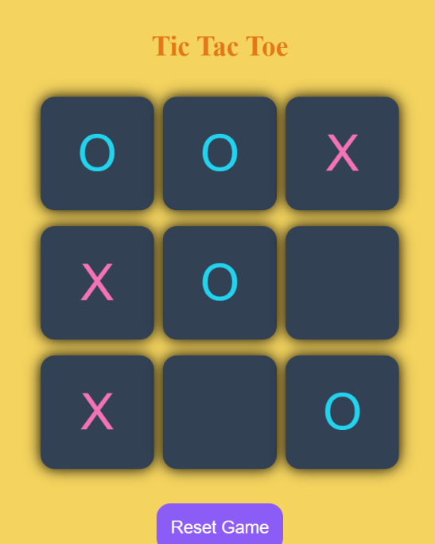
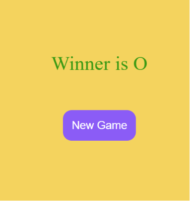

# 🎮 Tic-Tac-Toe Game

A simple and interactive Tic-Tac-Toe game built using **HTML, CSS, and JavaScript**. This project was created as a **practice project** to strengthen my understanding of JavaScript fundamentals, DOM manipulation, event handling, game logic, and UI styling.

## ✨ Features

* 🎯 Two-player gameplay (X and O)
* 🎨 Different colors for X and O
* 🏆 Winner detection
* 🤝 Draw detection
* 🔄 Reset and New Game functionality
* 📱 Responsive design
* 🌈 Custom themed UI

## 🛠️ Technologies Used

* HTML5
* CSS3
* JavaScript (ES6)

## 📚 What I Learned

Through this project, I practiced and improved my understanding of:

* DOM Manipulation
* Event Listeners
* Arrays and Loops
* Functions
* Conditional Statements
* Game Logic Implementation
* Dynamic Styling with JavaScript
* Resetting and Managing State

## 📸 Screenshots

### Game Board

<table>
  <tr>
    <td align="center">
      <br>
      <b>Gameplay Screen</b>
    </td>
    <td align="center">
      <br>
      <b>Winner Screen</b>
    </td>
  </tr>
</table>

<!-- > Add your screenshots inside a `screenshots` folder and update the image path if necessary. -->

## 🚀 Getting Started

1. Clone the repository

```bash
git clone https://github.com/bhagyashah-dev/Tic-Tac-Toe-Game.git
```

2. Navigate to the project directory

```bash
cd tic-tac-toe
```

3. Open `index.html` in your browser.

## 📖 References and Inspiration

This project was built while learning JavaScript and was inspired by the following resources:

* 🎥 YouTube Tutorial: <a href="https://www.youtube.com/watch?v=SqrppLEljkY&list=PLfqMhTWNBTe0PY9xunOzsP5kmYIz2Hu7i&index=13">Apna College JavaScript Tutorial</a>
* 📂 GitHub Repository: <a href="https://github.com/shradha-khapra/JavaScriptSeries/tree/main/TicTacToe">Apna College JavaScript Tutorial</a>

Special thanks to the creators of these resources for helping me understand the concepts and implementation.

## 🌱 Future Improvements

* Single-player mode with AI
* Score tracking
* Sound effects and animations
* Dark/Light mode
* Move history
* Improved UI and accessibility

## 📌 Note

This is a **practice project** created for learning purposes and to improve my JavaScript skills. Feedback and suggestions are always welcome!

---

⭐ If you found this project interesting, feel free to star the repository!
